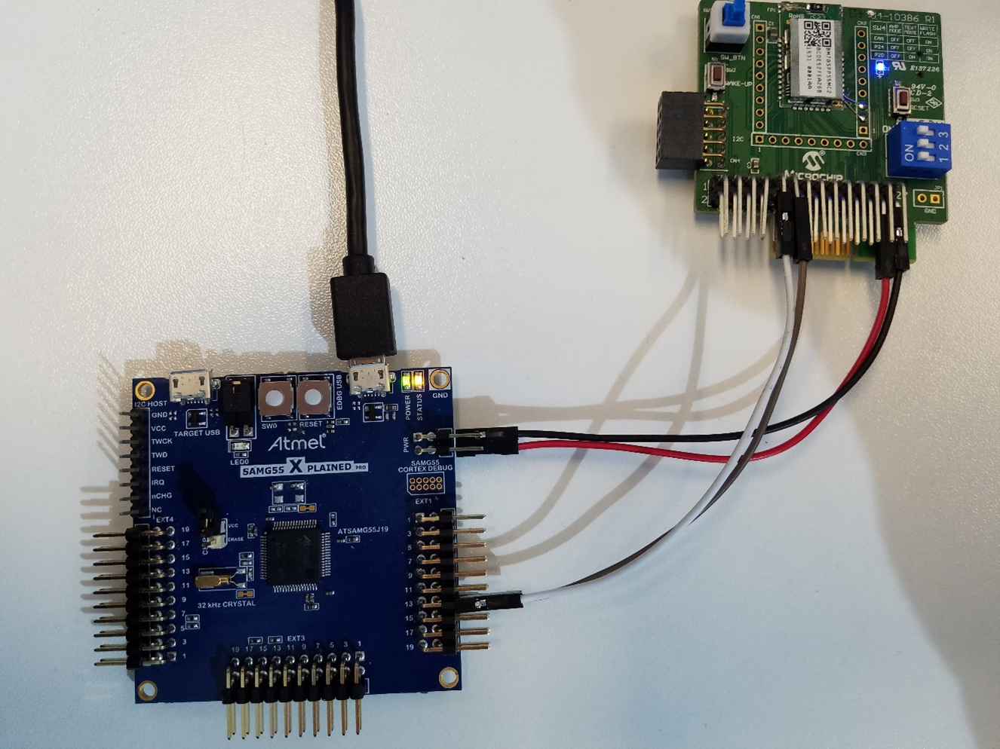
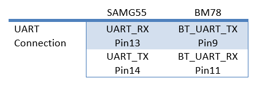
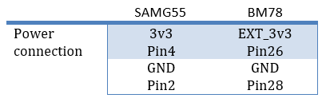
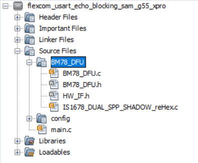
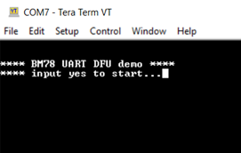
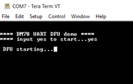
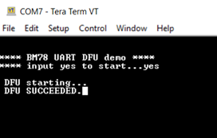
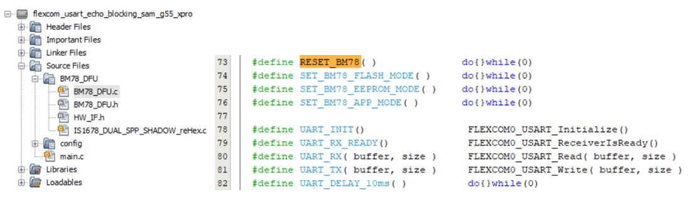

# RN4678/BM78_DFU_with_SAMG55

> "Wireless Made Easy!" - Firmware upgrade for RN and BM devices using host MCU over UART

# Guidelines to the end users
                                  
-	The user needs to consider taking adequate backup of the existing firmware running on the controller. The demo application erases the current firmware and update it with the newly flashed firmware. 
-	Flashing the demo application to the host MCU will remove the existing application that resides in the MCU. The DFU Demo application showcases a proof-of-concept example that update the firmware on the RN4678/BM78 module. User needs to modify according to their requirement. 

- The application flow is designed in such a way that it writes the firmware content into the flash memory and read back the content to make sure the writing action is executed successfully. The CRC check is not implemented either at the host MCU side nor at the RN4678/BM78 controller part to check whether the firmware is corrupted. 

- Updating the existing firmware resides at the RN4678/BM78 controller will erase the configuration content (Pairing info, RN4678/BM78 name etc) just like the norm firmware update. The user needs to do the re-configuration again after the firmware update. 

- The user needs to take care of the integrity and responsibility to ensure security concerns.

## Introduction 

This reference design uses SAMG55 XPLAINED PRO evaluation kit and BM78-PICTAIL. The SAMG55 will control the whole process of firmware DFU to BM78 using UART. The reference SAMG55 firmware is designed with latest revision of MPLAB-X and Harmony framework. However, it can be ported easily to other MCU and framework. Although it is demonstrated with BM78, actually it can be used for RN4678 as well.

For more details on the DFU protocol, we will provide soon after further review.

This DFU is for firmware upgrade. For EEPROM upgrade, Please refer to example [BM7x Configuration Library for PIC MCUs](https://ww1.microchip.com/downloads/en/DeviceDoc/BM7xConfigurationLibraryv1.10.zip) which also works for BM78. For more details on the EEPROM upgrade protocol, we will provide soon after further review.

# Setup the demo
This reference design uses SAMG55 XPLAINED PRO evaluation kit and BM78-PICTAIL. The SAMG55 will control the whole process of firmware DFU to BM78 using UART. 

SAMG55 XPLAINED PRO evaluation kit refers to:
https://www.microchip.com/DevelopmentTools/ProductDetails/PartNO/ATSAMG55-XPRO

BM78-PICTAIL refers to:
https://www.microchip.com/DevelopmentTools/ProductDetails/PartNO/BM-78-PICTAIL

BM78 module refers to:
https://www.microchip.com/wwwproducts/en/BM78

## Hardware Setup

- Connect the EDEBUG USB of SAMG55 EVB to PC
- Open the Terra Term to this EDEBUG USB on PC
- Connect UART0 on EXT1 of SAMG55 EVB to BT_UART on J1 of BM78 EVB

- Connect 3v3 on J100 of SAMG55 EVB to EXT_3v3 on J1 of BM78

- To ease the connection setup, P2_0, P2_4, EAN and RESET Pin are not connected to SAMG55 and they are controlled by the BM78 EVB.
Use SW4 to set BM78 in ‘WRITE FLASH’ mode with all pin set to ON. And then do a hardware reset by pressing SW3 the reset button. Then the blue LED will be blinking and BM78 is set to ‘WRITE FLASH’ mode.

## Firmware Setup
### Open the MPLAB-X project

The SAMG55 firmware is designed with MPLAB-X and Harmony latest revision. Open the project and one may see the BM78_DFU which includes the DFU code and a processed BM78 1v38 firmware which is stored in a C array. The only one exposed API to application level is BM78_DFU( ).

### Run the SAMG55 firmware

- Put BM78 in ‘WRITE FLASH’ mode manually as section 6.1
- Open a Tera Term on PC
- Compile and download the SAMG55
- On the Tera term, user is prompted to input yes to start the DFU

- Input ‘yes’ to start the DFU

- After around 2 minutes, the DFU is done with LED0 of SAMG55 on indicating a success DFU

# Port the code

The reference code is designed for easy porting to other MCU and its framework if customer is not using SAMG55 and Harmony framework.
As shown below, the hardware relevant API is declared in the HW_IF header file. There are 9 macro needed modification according to the user host MCU architecture and its framework if any. The 9 APIs are categorized into 3 types: GPIO control, UART interface and an optional delay API if more responsiveness is required.

# Appendix

A UART log file, [BM78-1V38-DFU-log-32Byte.sal](./BM78-1V38-DFU-log-32Byte.sal), in saleae Logic2 format is provided for reference. 
